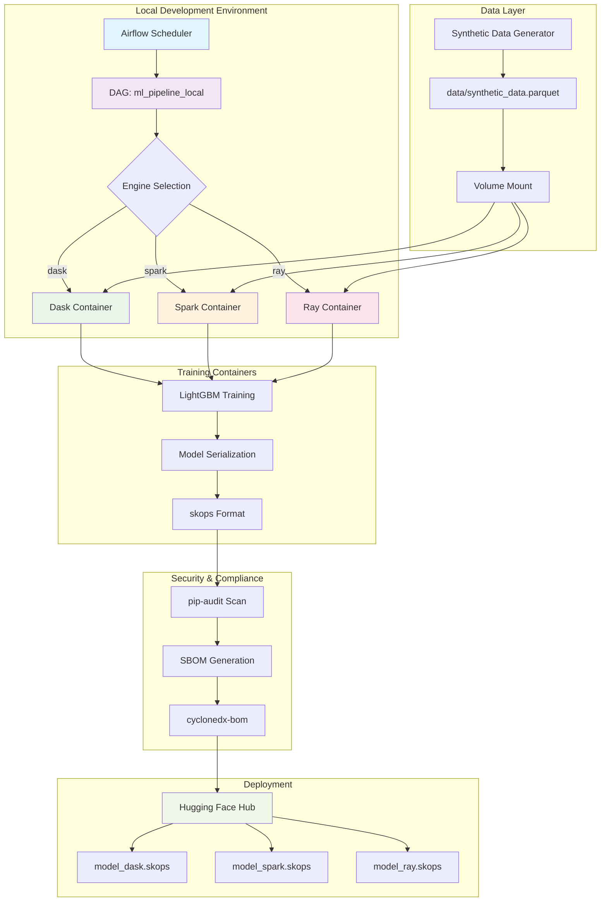
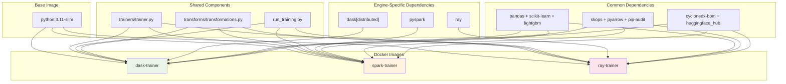
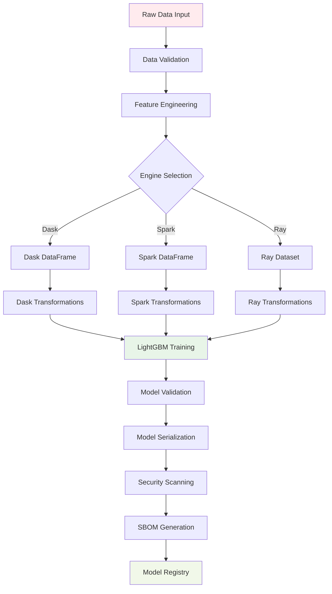
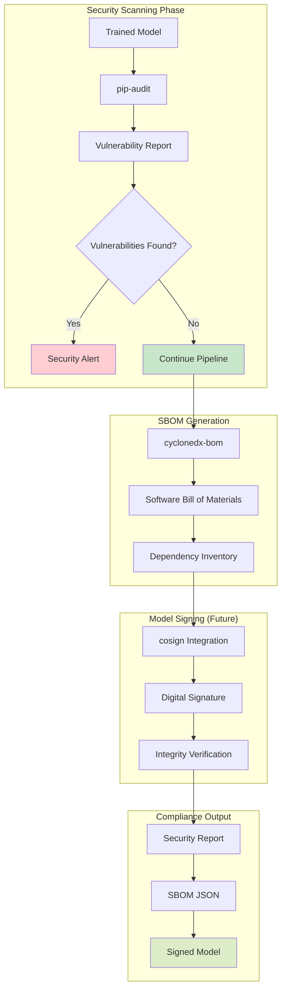
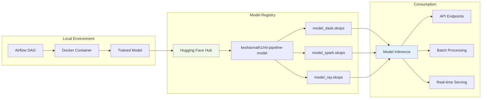
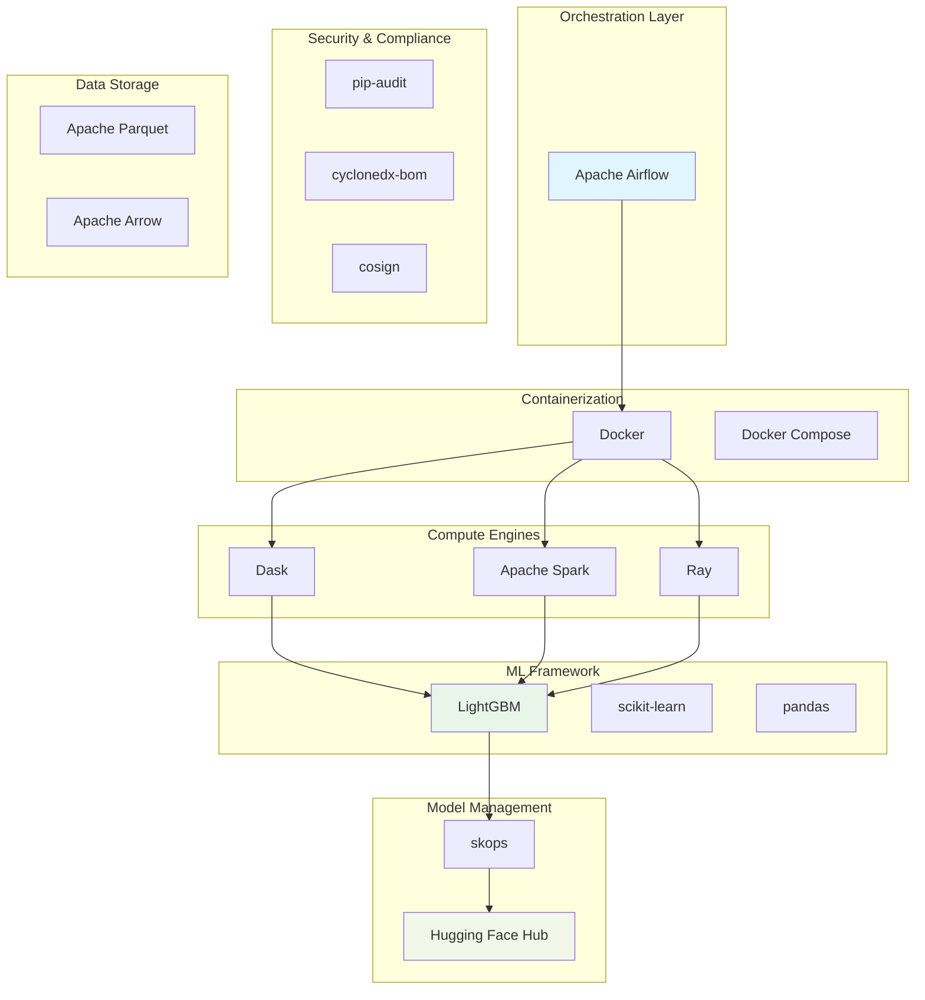

# 🏗️ Architecture Diagrams

## System Architecture Overview

## Container Architecture

## Data Flow Architecture

## Security Pipeline

## Deployment Architecture

## Engine Comparison Matrix

| Feature | Dask | Spark | Ray |
|---------|------|-------|-----|
| **Distributed Computing** | ✅ Native | ✅ Native | ✅ Native |
| **Python Integration** | ✅ Excellent | ⚠️ Good (PySpark) | ✅ Excellent |
| **Memory Management** | ✅ Lazy Evaluation | ✅ RDD/DataFrame | ✅ Object Store |
| **ML Libraries** | ✅ dask-ml | ✅ MLlib | ✅ Ray ML |
| **Ease of Use** | ✅ Pandas-like | ⚠️ SQL/DataFrame | ✅ Python-native |
| **Scalability** | ✅ Good | ✅ Excellent | ✅ Excellent |
| **Community** | ⚠️ Growing | ✅ Mature | ✅ Growing |

## Technology Stack

---

*These diagrams can be rendered in any Markdown viewer that supports Mermaid.js, or exported to various formats using tools like Mermaid CLI or online editors.*

