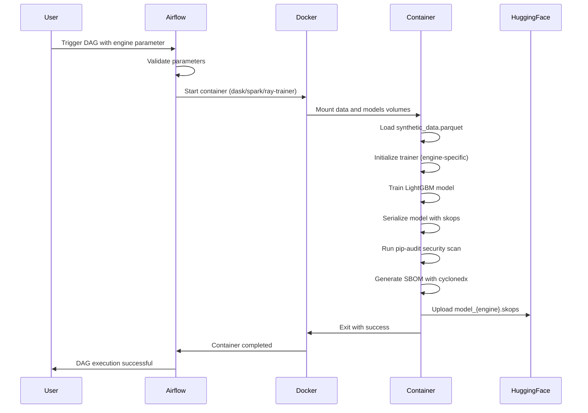
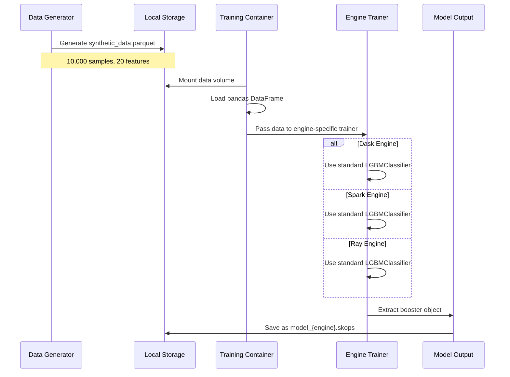
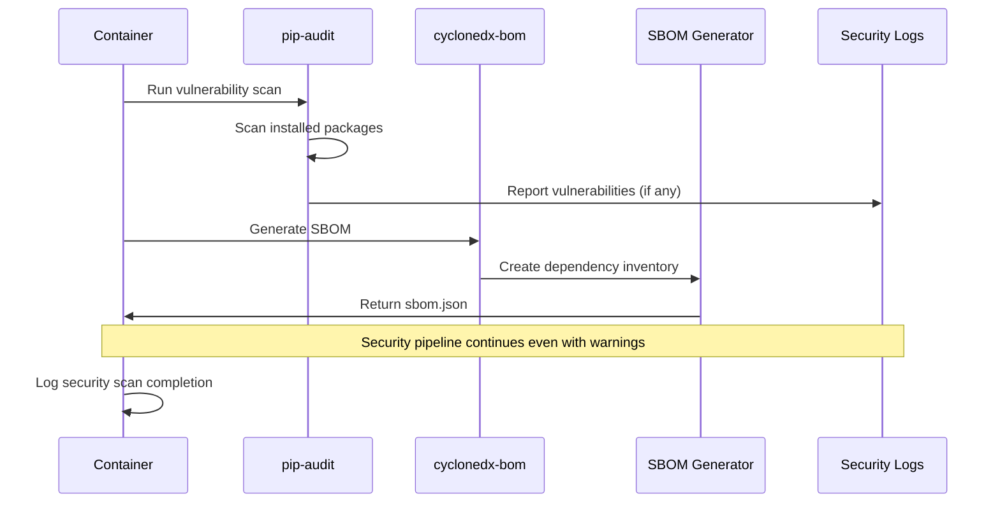
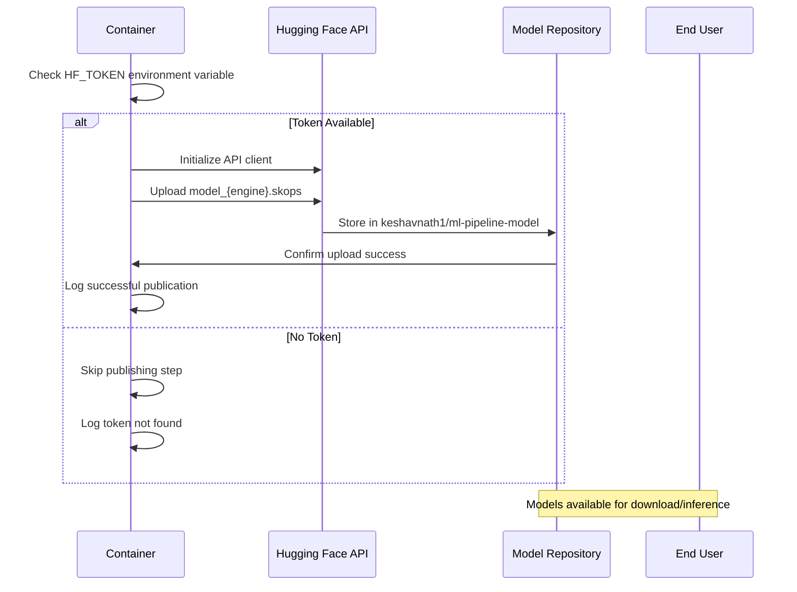
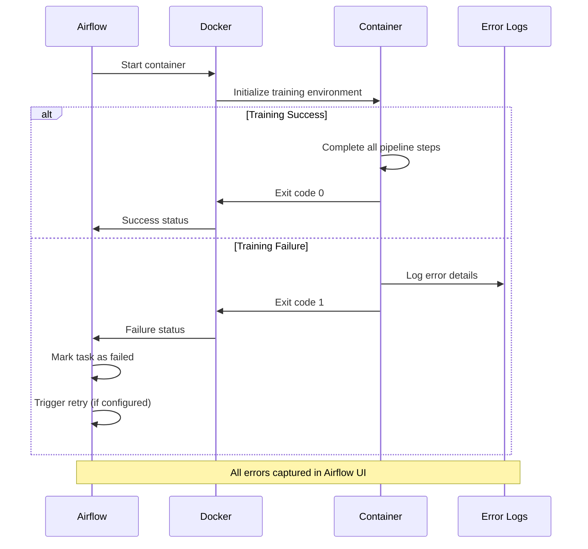
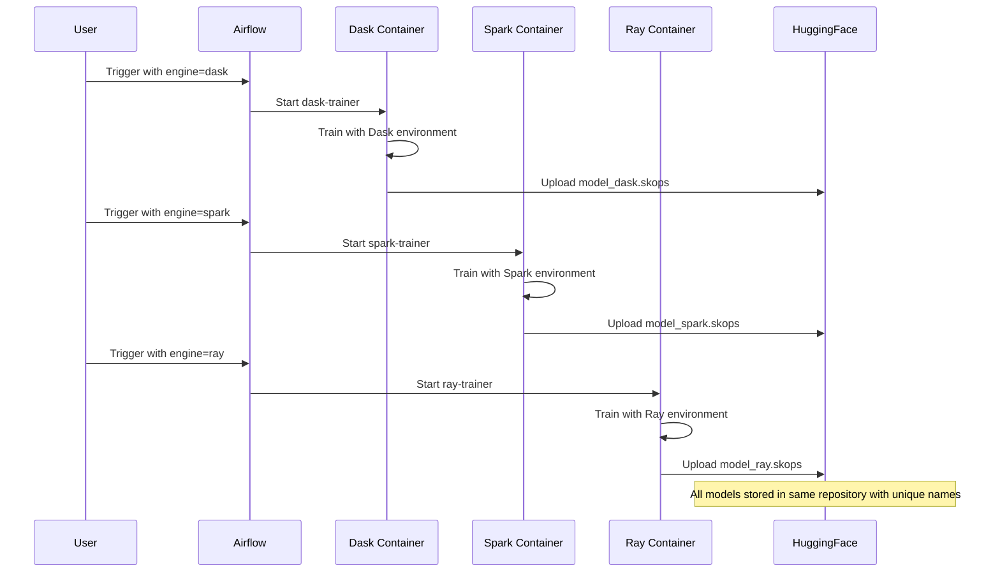
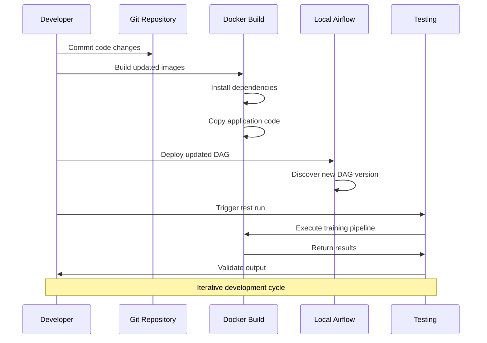
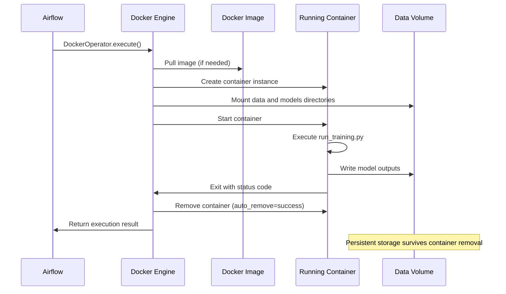
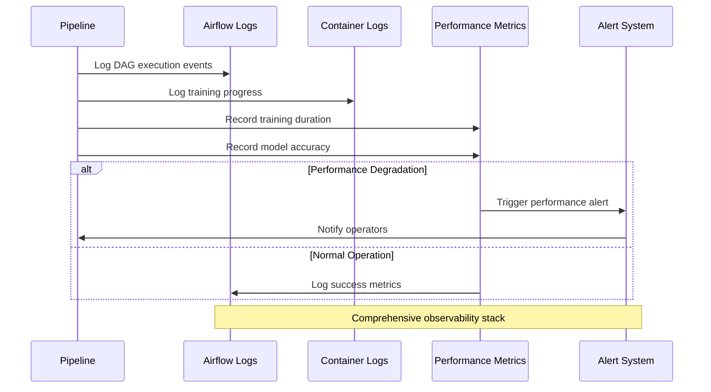

# 🔄 Sequence Diagrams

## Complete Pipeline Execution Flow

## Data Processing Sequence

## Security and Compliance Flow

## Model Publishing Sequence

## Error Handling Flow

## Multi-Engine Comparison Flow

## Development Workflow

## Container Lifecycle

## Monitoring and Observability

---

*These sequence diagrams illustrate the temporal flow of operations in the ML pipeline, showing how different components interact over time during various scenarios.*

